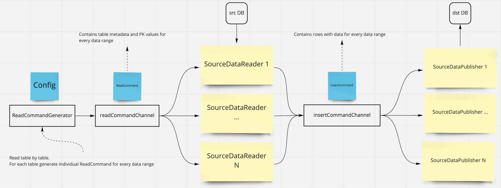

# MySQL Data Mover

This application moves data from one Mysql database to another.
It is faster and more robust than `mysqldump` utility, has ability to move data in parallel threads with retries.



Application read tables metadata from source MySql database,
then generates ReadCommand objects for data ranges, based on table primary key columns, and put them into queue.

Several SourceDataReader instances process ReadCommands in parallel, generate InsertCommand objects with table rows data
and put them into another queue.

At last, several SourceDataPublisher instances process InsertCommands in parallel and insert data into destination Mysql database.

Such decomposition brings ability to add retries for every command and make application more robust.

_NOTE:_

- All application aspects are configurable.
- For tables without primary keys, data range include all table rows.
- Application has ability to move database schema (tables, views, routines) from source to destination database at the beginning.

## How to run

- Publish project to the desired destination, eg. `./output`:

```console
dotnet publish --configuration Release --output ./output "./src/Dodo.DataMover/Dodo.DataMover.csproj"
```

- Create `appsettings.local.json` file at the `./output` folder, you may get this file as [template](src/Dodo.DataMover/appsettings.local.template.json).
- Run application

```console
ASPNETCORE_ENVIRONMENT=local dotnet ./output/Dodo.DataMover.dll
```

### How to run single-binary version

In single-binary distribution, ASPNETCORE_ENVIRONMENT variable will not work.

You can run the app with ConfigurationFilePath command line argument
```sh
./Dodo.DataMover DataMover__ConfigurationFilePath=<path>
```

.. or environment variable:
```sh
DataMover__ConfigurationFilePath=<path> ./Dodo.DataMover
```

The path to json config file can be relative to the working directory or rooted (full path).

## Configuration

You may pass configuration options via environment variables or command line arguments,
but more preferable way is using `appsettings.json` configuration file.

### Alternative ways to set configuration
Configuration is loaded in the following order, later setting overrides preceeding:
- appsettings.json
- appsettings.$ASPNETCORE_ENVIRONMENT.json (optional)
- Custom json file, specified with DataMover__ConfigurationFilePath command line argument or environment variable.
- Environment variables
- Command line arguments

In case of single-binary distribution, there is no way to specify appsettings.json or appsettings.$ASPNETCORE_ENVIRONMENT.json.
In this case it is preferrable to use the DataMover__ConfigurationFilePath setting to specify the file configuration file.

For command line and environment notation please refer to:
https://docs.microsoft.com/en-us/aspnet/core/fundamentals/configuration/?view=aspnetcore-3.1

You may use [appsettings.local.template.json](src/Dodo.DataMover/appsettings.local.template.json) as template for you configuration.
All configuration settings combined in `DataMover` object.

The following table lists the configurable parameters and their default values.

| Parameter                         | Description                                                                                                                                                     | Default |
| --------------------------------- | --------------------------------------------------------------------------------------------------------------------------------------------------------------- | ------- |
| `RetryInitialDelaySeconds`        | Initial delay before linear backoff for command retries                                                                                                         | `3`     |
| `RetryCount`                      | Max retry count before application raise error                                                                                                                  | `5`     |
| `ReadConcurrency`                 | Number of parallel read tasks                                                                                                                                   | `1`     |
| `InsertConcurrency`               | Number of parallel insert tasks                                                                                                                                 | `1`     |
| `ReadBatchSize`                   | Number of rows to read per one read command. Insert rows batch size depends on table columns count, and limited by 10000 insert parameters.                     | `5000`  |
| `JobTimeoutMinutes`               | Maximum application execution time before failing by timeout                                                                                                    | `600`   |
| `Limit`                           | Maximum number of rows to move from each table                                                                                                                  | `null`  |
| `LimitOverrides`                  | Map, where key - regex to select table, and value - maximum number of rows to move for this table. For example, `"deliverylocalitiesstreets": 200000`           | `{}`    |
| `InsertCommandTimeoutSeconds`     | Insert command timeout                                                                                                                                          | `30`    |
| `DataReadCommandTimeoutSeconds`   | Read command timeout                                                                                                                                            | `30`    |
| `SchemaReadCommandTimeoutSeconds` | Schema read command timeout                                                                                                                                     | `60`    |
| `DropDatabase`                    | If true, then drop destination database first                                                                                                                   | `false` |
| `IncludeTableRegexes`             | Array of regular expressions, to include tables for moving data, has priority against ExcludeTableRegexes parameter                                             | `[]`    |
| `ExcludeTableRegexes`             | Array of regular expressions, to exclude tables from moving data                                                                                                | `[]`    |
| `InsertIgnore`                    | If true, then use `INSERT IGNORE` statement and ignore duplicate PK errors in inserting                                                                         | `false` |
| `SqlMode`                         | May contain string with comma separated sql modes, for example `STRICT_ALL_TABLES`. Do not set it at config, if you want null value.                            | `null`  |
| `DebugDelaySeconds`               | Delay for debug purposes, used in schema read and insert operations                                                                                             | `0`     |
| `SkipColumnsRegexes`              | Map, where key - regex to select table, and value - array of column names, which values will be skipped. For example, `"supplycomposition": ["ModifiedUserId"]` | `{}`    |
| `DatabaseCollation`               | Override destination database collation. If not set, source database collation is used.                                                                         | `null`  |
| `DatabaseCharacterSet`            | Override destination database character set. If not set, source database character set is used.                                                                 | `null`  |
| `CreateSchema`                    | If true, then create schema (tables, views, routines, triggers) on destination database.                                                                        | `true`  |
| `ConnectionStrings.Src`           | _Required_ Connection string to source database                                                                                                                 | `null`  |
| `ConnectionStrings.Dst`           | _Required_ Connection string to destination database                                                                                                            | `null`  |

## How to develop

- Run `./run-docker-compose.sh` and you will have two running Mysql instances (`mysql-data-mover-src` and `mysql-data-mover-dst`)
- Copy `src/Dodo.DataMover/appsettings.local.template.json` into `src/Dodo.DataMover/appsettings.local.json`, tune application settings
- Set environment variable `ASPNETCORE_ENVIRONMENT=local` in your IDE
- Run Dodo.DataMover application from IDE
- See application log in Terminal
- Connect to `mysql-data-mover-dst` Mysql database on `33061` port and check if data was moved as you expected.

## How to test

There are two kinds of tests in project:

- Unit tests at Dodo.DataMover.Tests. You may run them manually. Also unit tests run at Docker image build step (ex. `./run-build-image.sh build local-run`).
- Integration tests are available at `run-integration-test.sh` script, can be run manually and as step of GitHub Actions pipeline.
